# QalNet — System Architecture & Design Diagrams

**Document Version:** 1.0
**Status:** ✅ Aligned with current implementation
**Source of truth:** `apps/backend/src`, `apps/backend/database/schema.sql`, `docker-compose.yml`, `apps/web/src/app`

All diagrams are written in Mermaid. They render on GitHub, GitLab, and in VS Code
(Markdown Preview Mermaid Support). A floating diagram-figure (`architecture/page.tsx`)
also exists in the app at `http://localhost:3001/architecture`.

---

## 1. System Context Diagram (C4 — Level 1)

Shows the system boundary and the external actors/services it talks to.

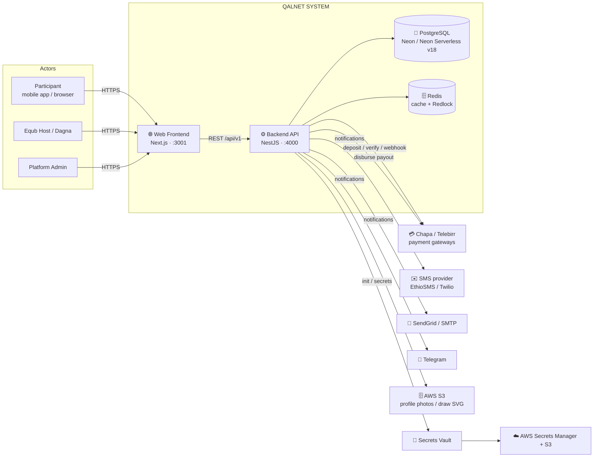

---

## 2. Container / Component Diagram (C4 — Level 2)

The monorepo is a Turborepo workspace; both apps share types and config packages.

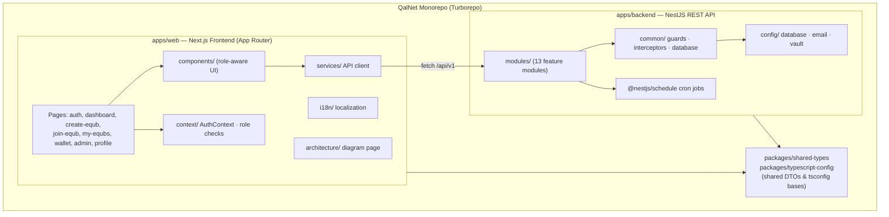

### Backend module decomposition

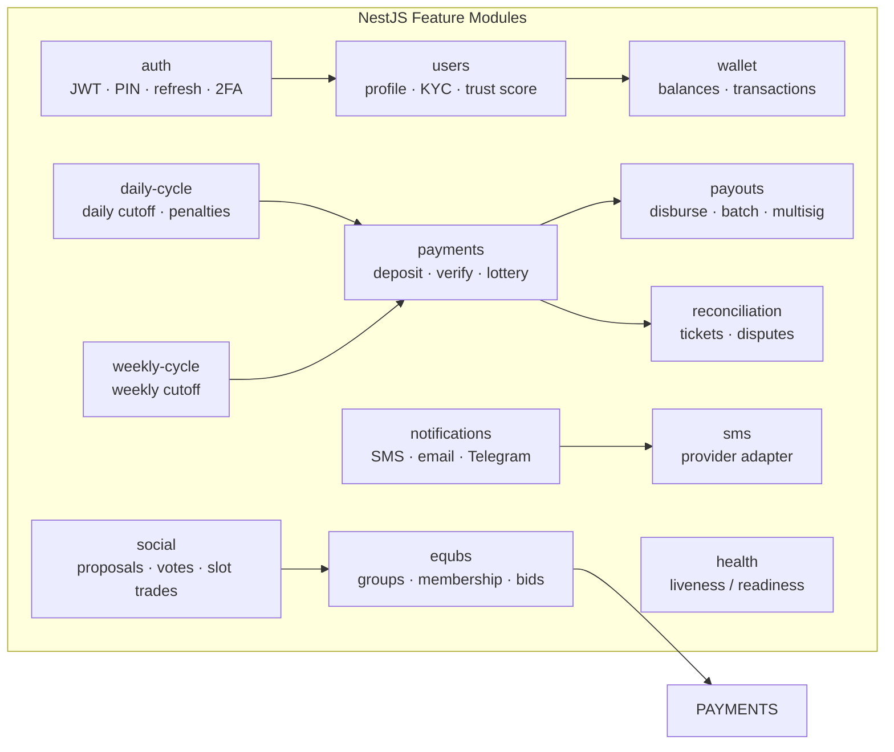

---

## 3. Database ERD (Core Domain)

Condensed from `apps/backend/database/schema.sql` + migrations. Core financial
entities on the left, support/analytics on the right.

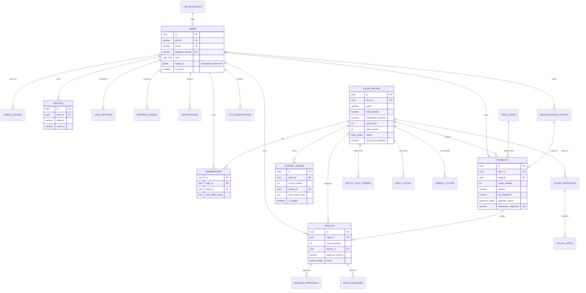

---

## 4. Authentication & Authorization Flow (Sequence)

PIN/phone login → JWT (RSA-2048) + rotating refresh token (httpOnly cookie) →
role-based guards at API layer & Row-Level Security at DB layer.

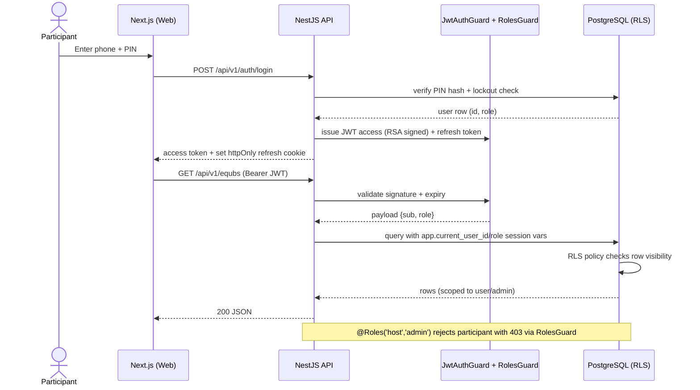

---

## 5. Equb Lifecycle State Diagram

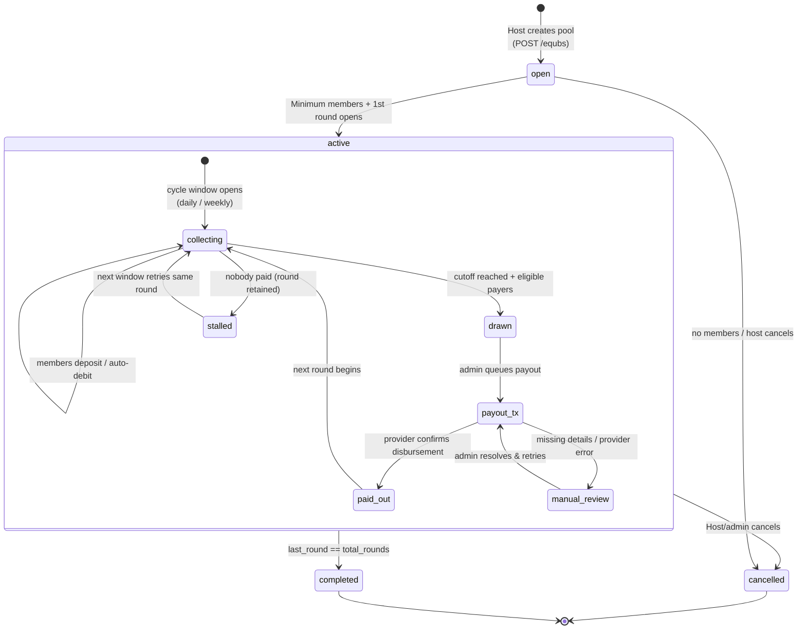

---

## 6. Daily / Weekly Cycle Engine (Sequence)

Triggered by cron (`DailyCycleTask` / `WeeklyCycleTask`) at each equb's cutoff.

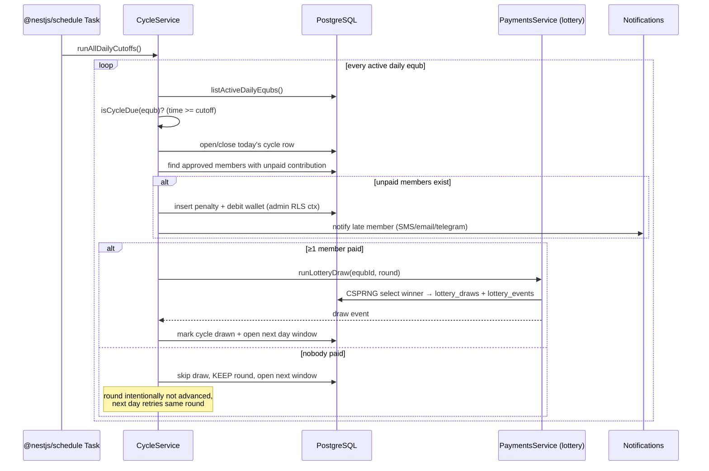

---

## 7. Deposit / Payment Flow (Sequence)

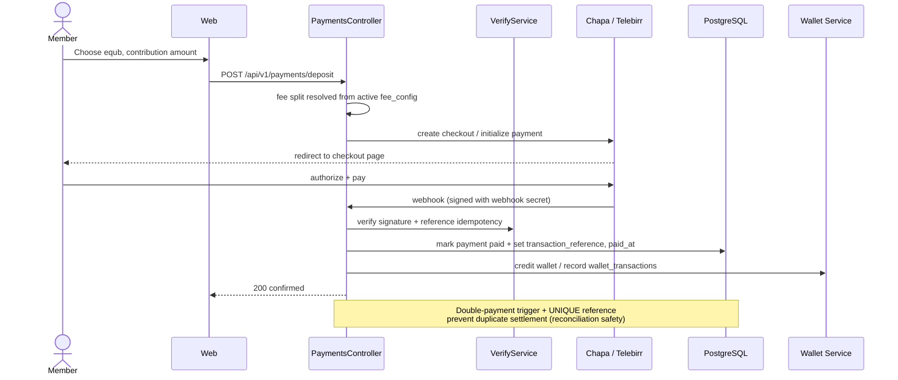

Payout disbursement follows the same provider confirmation rule:
`pending → queued → processing → success | failed → retry | manual_review`.

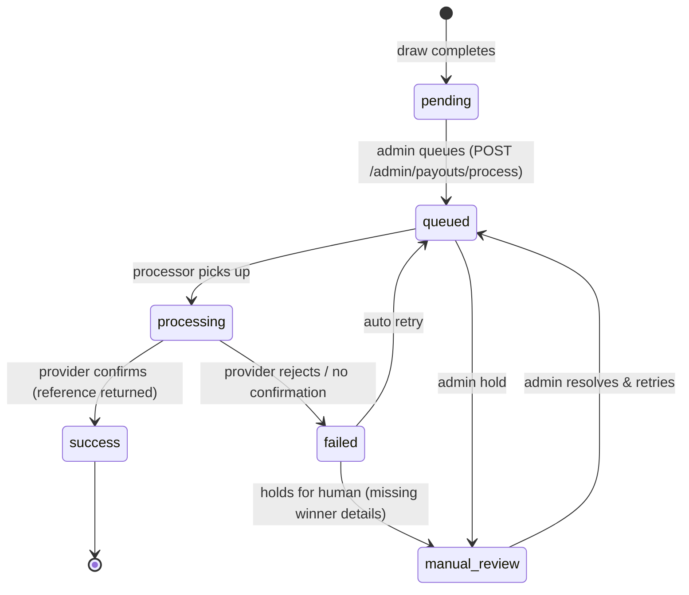

Large pots (≥ 1M ETB) additionally require `multisig_approvals` before dispatch.

---

## 8. Deployment Architecture (Docker Compose)

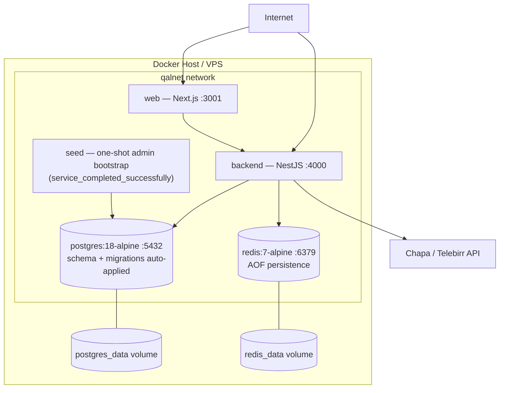

- Run: `docker compose up -d --build`; lite infra only: `docker compose -f docker-compose-lite.yml up -d`.
- On fresh volume: `schema.sql` runs first, then `.sql` in `migrations/` in numeric order.
- Non-Docker production: **PM2** (`npm run pm2:start`) auto-restarts both apps; logs in `~/.pm2/logs`.

---

## 9. Use-Case Diagram (RBAC)

Three-tier roles: `participant`, `host` (Dagna), `admin`. Guards + RLS enforce
the boundaries. Direct equb creation is admin-only; hosts/members request equbs.

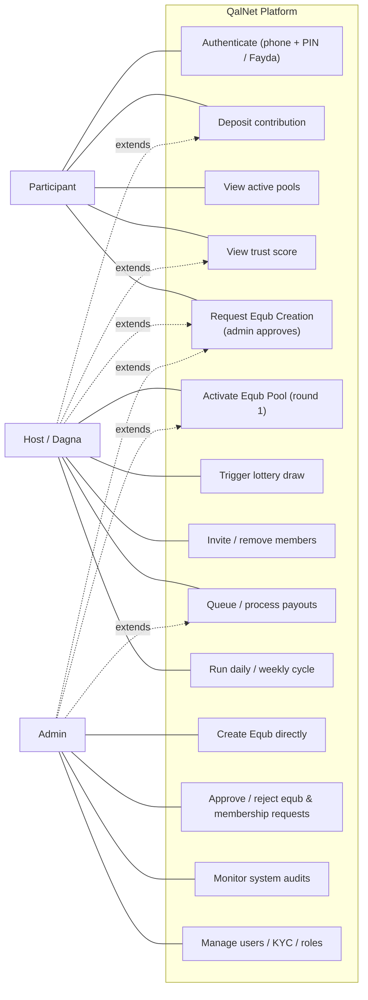

---

## 10. Security & Data Isolation Context

Defense in depth across three layers (API guard → DB RLS → UI rendering).

```mermaid
flowchart LR
    REQ["Request (Bearer JWT)"]
    subgraph API_LAYER["API Layer"]
        JG[JwtAuthGuard<br/>RSA-2048 signature + expiry]
        RG[RolesGuard<br/>@Roles('participant','host','admin')]
        VP[ValidationPipe<br/>whitelist + DTO transform]
        RL[Rate limiting<br/>general/auth/payment]
    end
    subgraph DB_LAYER["Database Layer"]
        CTX["app.current_user_id / role<br/>session context"]
        RLS[RLS policies<br/>user_isolation · wallet · payment]
        AUD[audit_logs triggers<br/>INSERT/UPDATE/DELETE]
    end
    subgraph UI_LAYER["Frontend Layer"]
        HASH[AuthContext hasRole/can* checks]
        PROTECT[Protected routes + conditional render]
    end

    REQ --> JG --> RG --> VP --> RL
    RL --> CTX --> RLS --> AUD
    RL --> UI_LAYER
```

- **Passwords:** Argon2 with pepper. **PIN:** 4–6 digits, lockout after failed attempts (`008`).
- JWTs signed with **2048-bit RSA**; refresh tokens stored as hashes and rotated.
- `fayda_id` is encrypted at the application level (`pgp_sym_encrypt`).
- Fees: `fee_config` enforces `host_rate + admin_rate = total_rate` via CHECK constraint.
- **Financial integrity:** payments use a UNIQUE `transaction_reference` with a success CHECK
  constraint; payouts only reach `success` after provider confirmation.

---

## References

| Doc | Location |
|-----|----------|
| Code structure | `FILE_STRUCTURE.md` |
| Functional requirements | backend modules in `apps/backend/src/modules/` |
| Roles & RBAC | `ROLE_BASED_RESPONSIBILITIES.md` |
| Database DDL + RLS | `apps/backend/database/schema.sql` + `migrations/` |
| Env / integrations | `.env.example`, `PAYMENT_CONFIGURATION.md` |
| Deployment | `PRODUCTION_DEPLOYMENT_CHECKLIST.md`, `docker-compose.yml` |